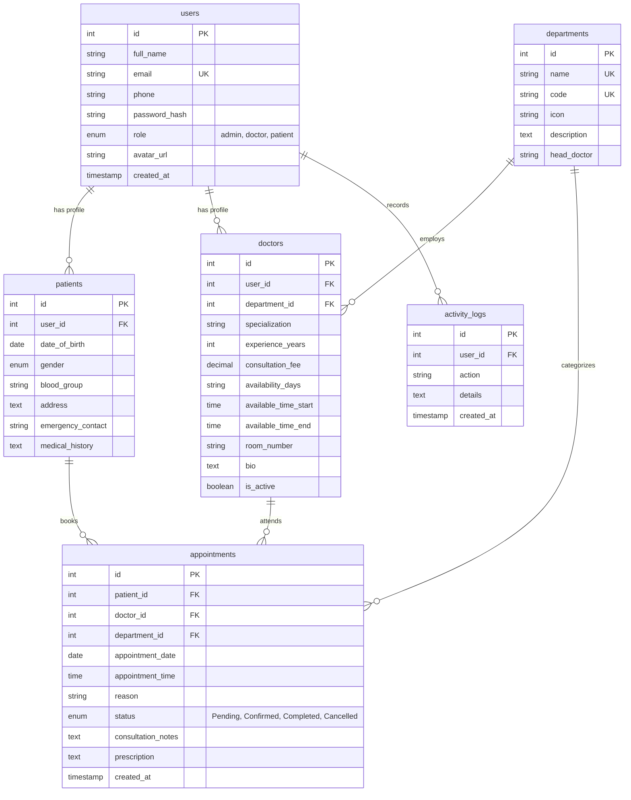

# MediLink – Healthcare & Clinic Management System

**iNeuBytes Internship – Major Project**  
**Author:** Muhammed Sijan (Intern ID: `INBT022137`)  
**Technology Stack:** Node.js, Express.js, MySQL (`mysql2`), HTML5, CSS3, Vanilla JavaScript (ES6+)

---

## 1. Project Overview & Objective

**MediLink** is an enterprise-grade Healthcare and Clinic Management System designed to streamline patient intake, physician schedule coordination, multi-department clinical operations, and electronic consultation records.

### Core Problem Solved
Traditional clinic workflows often suffer from fragmented patient records, double-booking conflicts, lack of role-based security, and disconnected departmental data. MediLink addresses this with a centralized, normalized relational database architecture, real-time slot conflict prevention, and distinct role-tailored dashboards.

---

## 2. Technology Stack & Design Architecture

### Backend & Database
- **Runtime:** Node.js (v24+)
- **Framework:** Express.js REST API
- **Database:** MySQL Relational Database (`mysql2/promise` connection pool)
- **Security:** `bcryptjs` password hashing (10 rounds), JSON Web Tokens (JWT), role-based middleware (`verifyToken`, `requireRole`), parameterized SQL queries to prevent SQL Injection.

### Frontend
- **Structure:** Semantic HTML5
- **Styling:** Modern Vanilla CSS3 design system with custom CSS properties, responsive flex/grid layouts, card elevation, and status tokens.
- **Client Logic:** Vanilla JavaScript (ES6+) with `fetch()` API, client-side validation, interactive modal managers, and toast notifications.
- **Zero Frontend Frameworks:** No React, Angular, Vue, Next.js, Bootstrap, or Tailwind CSS used, fulfilling the strict framework-free requirement.

---

## 3. Visual Design System

MediLink introduces a unified clinical management design system centered around a fixed Left Navigation Sidebar:

| Element | Color Code | Purpose |
| :--- | :--- | :--- |
| **Sidebar Navy** | `#182238` | Primary navigation background |
| **Sidebar Dark** | `#10182A` | Brand header & elevation accents |
| **Primary Lavender** | `#7667E8` | Primary buttons, active tabs, brand accents |
| **Light Lavender** | `#EEEAFE` | Icon pill containers & badges |
| **Mint Accent** | `#CFF5E9` | Success notifications, available slots, doctor badges |
| **Soft Sky** | `#E5EEFF` | Confirmed appointments, general info tiles |
| **Warm Peach** | `#FFF0E9` | Pending consultations, secondary highlights |
| **Main Background** | `#F7F8FC` | Spacious, eye-friendly layout background |
| **Card Surface** | `#FFFFFF` | Subtle border and elevation surfaces |

---

## 4. Role-Based Capabilities & Workflows

### 👤 Patient Module
- **Registration & Authentication:** Secure patient profile creation with medical history and emergency contacts.
- **Patient Dashboard:** Overview of upcoming consultations, countdown, past medical history, and quick-booking launcher.
- **Doctor Directory:** Filter physicians by department, experience, and consultation fees.
- **Appointment Booking Engine:** Select date and available time slot with automatic double-booking prevention.
- **History & Records:** Complete historical log with physician diagnoses, notes, and prescriptions.

### 🩺 Doctor Module
- **Doctor Dashboard:** Live view of today's appointment queue, pending consultation requests, and assigned patient volume.
- **Clinical Triage & Notes:** Update appointment status (`Pending` &rarr; `Confirmed` &rarr; `Completed` / `Cancelled`) and record clinical observations and prescriptions.
- **Patient Health Summary:** Quick access to patient medical background, blood group, and emergency contacts.

### ⚡ Admin Module
- **KPI Metrics & Analytics:** Real-time summary of total patients, active physicians, departments, and booking volume.
- **Visual Analytics:** Real-time distribution charts for Appointment Status, Department Demand, and Doctor Consultation Workload.
- **Master CRUD Operations:**
  - **Doctors:** Add new physician profiles, assign departments, configure fees, and update active statuses.
  - **Departments:** Create, edit, and safely manage hospital clinical divisions.
  - **Patients:** View master index, inspect historical appointments, and update profiles.
  - **Appointments:** Oversee system-wide bookings with cancellation and deletion authority.

---

## 5. Database Schema Architecture

The MySQL database (`medilink_db`) contains 6 normalized relational tables:



---

## 6. Demo Accounts (Clearly Labeled for Testing)

The system includes pre-seeded demo accounts with encrypted passwords:

| Role | Email Address | Password | Description |
| :--- | :--- | :--- | :--- |
| **Admin** | `admin@medilink.com` | `Admin@123` | Full administrative command center access |
| **Doctor** | `dr.sarah@medilink.com` | `Doctor@123` | Cardiology specialist clinical queue |
| **Doctor** | `dr.david@medilink.com` | `Doctor@123` | Neurology senior consultant queue |
| **Patient** | `john.doe@medilink.com` | `Patient@123` | Patient with upcoming & completed visits |
| **Patient** | `emily.watson@medilink.com` | `Patient@123` | Patient with pending appointment |

> 💡 **Quick Fill:** The [Login Page](file:///client/login.html) features **1-Click Demo Account Quick Fill buttons** for effortless testing of each role.

---

## 7. Installation & Quickstart Guide

### Prerequisites
1. **Node.js** (v18.0.0 or higher)
2. **MySQL Server** (e.g., standalone MySQL, XAMPP, WAMP, or Docker container)

### Step 1: Clone or Navigate to Directory
```bash
cd Major_Project
```

### Step 2: Install Node Dependencies
```bash
npm install
```

### Step 3: Configure Environment Variables
Copy `.env.example` to `.env` and adjust database credentials:
```env
PORT=5000
NODE_ENV=development

DB_HOST=127.0.0.1
DB_PORT=3306
DB_USER=root
DB_PASSWORD=your_mysql_password
DB_NAME=medilink_db

JWT_SECRET=medilink_jwt_super_secret_key_2026_ineubytes_internship
JWT_EXPIRES_IN=24h
```

### Step 4: Initialize MySQL Database
Run the automated schema creation and seed script:
```bash
npm run init-db
```
*(Alternatively, import `database/schema.sql` followed by `database/seed.sql` using MySQL Workbench or phpMyAdmin).*

### Step 5: Start MediLink Server
```bash
npm start
```
Open your browser at: **`http://localhost:5000`**

---

## 8. REST API Endpoints Summary

All protected endpoints require the HTTP header: `Authorization: Bearer <JWT_TOKEN>`.

### Authentication & Profile (`/api/auth`)
- `POST /api/auth/register` – Register new patient account
- `POST /api/auth/login` – Authenticate user and issue JWT
- `GET /api/auth/me` – Retrieve authenticated user profile *(Protected)*
- `PUT /api/auth/profile` – Update profile details *(Protected)*
- `PUT /api/auth/password` – Update user password *(Protected)*
- `POST /api/auth/logout` – Invalidate session *(Protected)*

### Doctors (`/api/doctors`)
- `GET /api/doctors` – List all physicians with department joins and query filters
- `GET /api/doctors/:id` – Fetch physician profile details
- `GET /api/doctors/:id/availability?date=YYYY-MM-DD` – Retrieve available time slots
- `POST /api/doctors` – Add new physician *(Admin Only)*
- `PUT /api/doctors/:id` – Update physician details *(Doctor/Admin)*
- `DELETE /api/doctors/:id` – Deactivate/Delete physician *(Admin Only)*

### Patients (`/api/patients`)
- `GET /api/patients` – Master patient index *(Doctor/Admin)*
- `GET /api/patients/:id` – Fetch patient details & appointment history *(Doctor/Admin/Self)*
- `PUT /api/patients/:id` – Update patient records *(Admin/Self)*
- `DELETE /api/patients/:id` – Delete patient record *(Admin Only)*

### Departments (`/api/departments`)
- `GET /api/departments` – List all medical departments and physician counts
- `GET /api/departments/:id` – Fetch department details with specialist roster
- `POST /api/departments` – Create new department *(Admin Only)*
- `PUT /api/departments/:id` – Update department details *(Admin Only)*
- `DELETE /api/departments/:id` – Delete department safely *(Admin Only)*

### Appointments & Booking Engine (`/api/appointments`)
- `GET /api/appointments` – List appointments filtered by role, status, or date *(Protected)*
- `GET /api/appointments/:id` – Fetch single appointment details *(Protected)*
- `POST /api/appointments` – Book appointment with conflict checking *(Protected)*
- `PUT /api/appointments/:id/status` – Update consultation notes & status *(Doctor/Admin)*
- `PUT /api/appointments/:id/cancel` – Cancel appointment *(Patient/Doctor/Admin)*
- `DELETE /api/appointments/:id` – Permanently delete appointment *(Admin Only)*

### Analytics & Reports (`/api/analytics`)
- `GET /api/analytics/dashboard` – Overall KPI counters and operational metrics *(Admin/Doctor)*
- `GET /api/analytics/reports` – Status, department, and doctor workload breakdowns *(Admin/Doctor)*

---

## 9. Postman Collection

Import the included collection into Postman:
- File path: `postman/MediLink-API-Collection.json`
- Configured with environment variable `{{baseUrl}}` (defaults to `http://localhost:5000/api`)
- Covers all 22+ API endpoints across 6 categorized folders.

---

## 10. Verification & Testing Checklist

- [x] **Authentication:** Patient registration, secure bcrypt hashing, JWT issuance, 1-click demo login, logout.
- [x] **Role-Based Access Control:** Unauthorized access blocked (e.g. patients cannot access admin dashboard, doctors restricted to their patient queue).
- [x] **Appointment Booking Engine:** Validates future dates, checks doctor schedule, prevents double-booking conflicts (returns `409 Conflict`).
- [x] **Doctor Consultation Triage:** Doctors can update appointment statuses (`Pending` &rarr; `Confirmed` &rarr; `Completed`) and add clinical notes and electronic prescriptions.
- [x] **Admin Operations:** Complete CRUD for Doctors, Patients, Departments, and Appointments with live KPI counters and progress charts.
- [x] **Responsiveness:** Full layout testing across Desktop (1440px), Tablet (1024px, 768px), and Mobile (375px) with slide-out navigation drawer.
- [x] **Database Relational Integrity:** Primary keys, foreign keys, cascading deletes, and parameterized queries.

---

## 11. License
Developed for the **iNeuBytes Internship Major Project** by Muhammed Sijan. All rights reserved.
